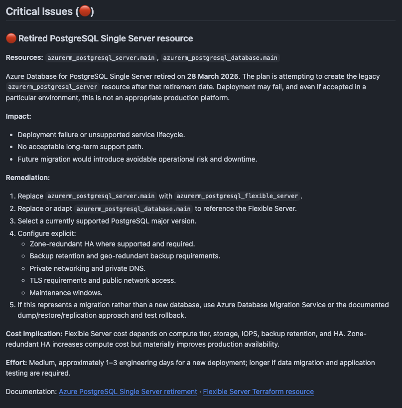
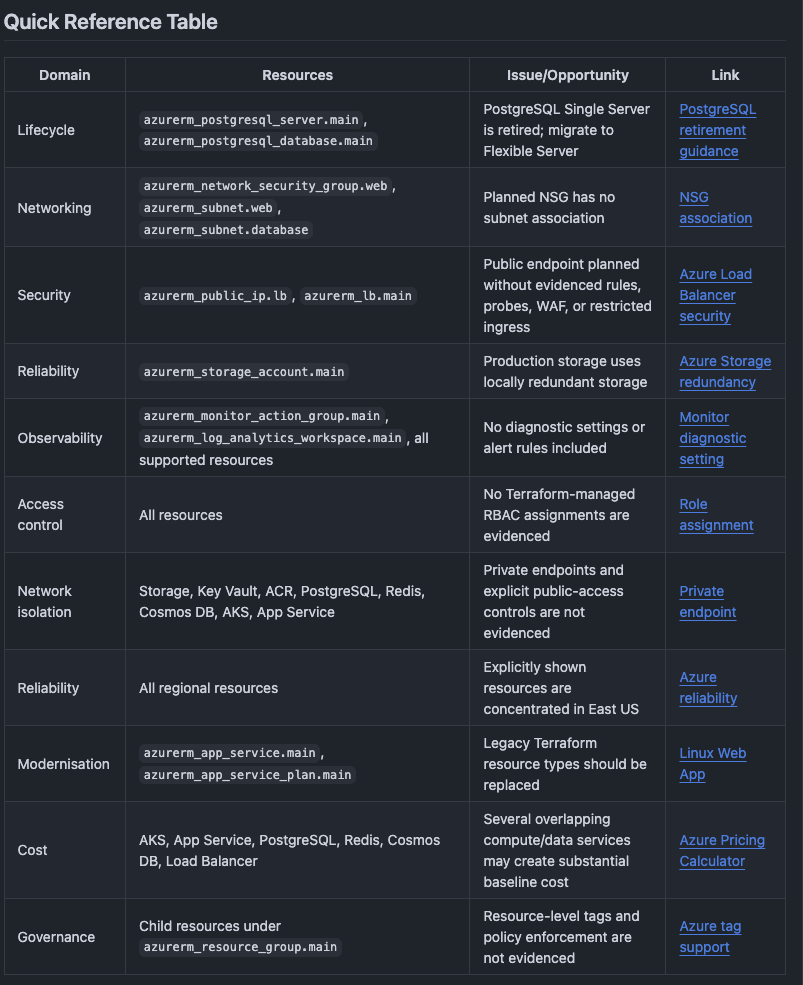
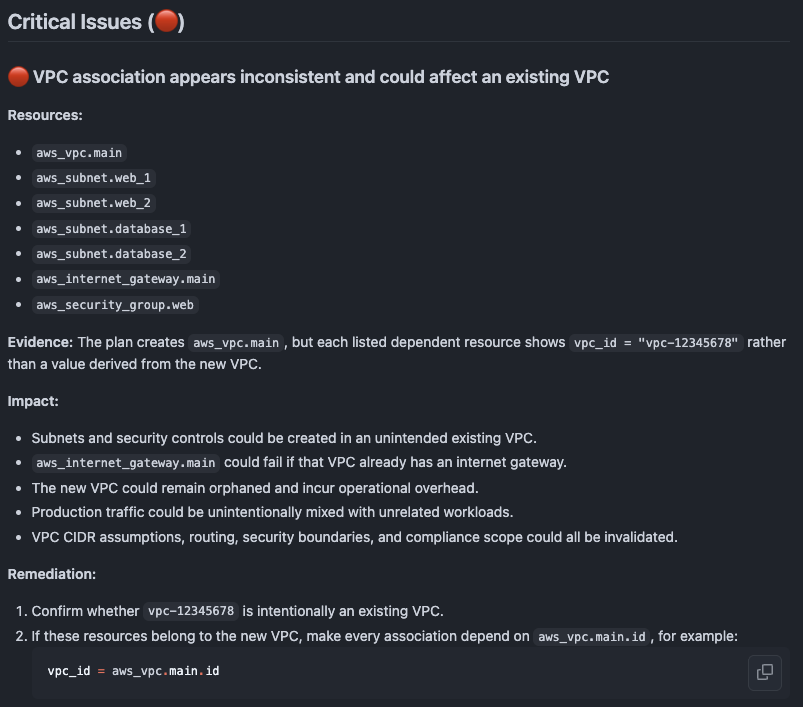
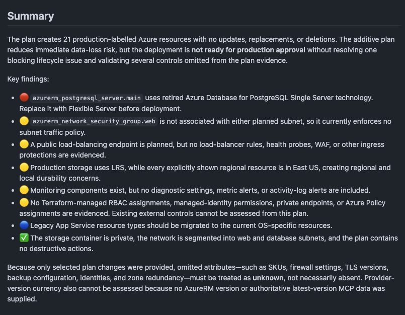

# Examples

Replace `<commit-sha>` in these examples with a revision that you reviewed.

## Example review

These screenshots show review results from [PR #86](https://github.com/thomast1906/terraform-review-ai-action/pull/86).

=== "Azure summary"

    

=== "Azure quick reference"

    

=== "Azure PostgreSQL issue"

    

=== "AWS VPC issue"

    

## Basic pull-request review

```yaml
name: Terraform AI review
on:
  pull_request:
    paths: ['**/*.tf', '**/*.tfvars']
permissions:
  contents: read
  pull-requests: write
jobs:
  review:
    runs-on: ubuntu-latest
    steps:
      - uses: actions/checkout@v7
      - uses: hashicorp/setup-terraform@v3
      - run: |
          terraform init -input=false
          terraform plan -input=false -out=tfplan.binary
          terraform show -json tfplan.binary > tfplan.json
      - uses: thomast1906/terraform-ai-review-action@<commit-sha>
        with:
          foundry-api-key: ${{ secrets.FOUNDRY_API_KEY }}
          foundry-endpoint: ${{ secrets.FOUNDRY_ENDPOINT }}
          foundry-deployment: terraform-review
          github-token: ${{ github.token }}
```

## Security-focused review

```yaml
- uses: thomast1906/terraform-ai-review-action@<commit-sha>
  with:
    foundry-api-key: ${{ secrets.FOUNDRY_API_KEY }}
    foundry-endpoint: ${{ secrets.FOUNDRY_ENDPOINT }}
    foundry-deployment: terraform-review
    analysis-mode: comprehensive
    analysis-preset: security-audit
    analysis-depth: detailed
    analysis-style: severity
    fail-on-severity: critical
    github-token: ${{ github.token }}
```

## Fast review

```yaml
- uses: thomast1906/terraform-ai-review-action@<commit-sha>
  with:
    foundry-api-key: ${{ secrets.FOUNDRY_API_KEY }}
    foundry-endpoint: ${{ secrets.FOUNDRY_ENDPOINT }}
    foundry-deployment: terraform-review
    analysis-mode: plan-only
    analysis-preset: quick-check
    analysis-depth: quick
    fail-on-severity: none
    github-token: ${{ github.token }}
```

## No pull-request comment

This pattern only needs `contents: read` permission:

```yaml
permissions:
  contents: read

steps:
  - uses: thomast1906/terraform-ai-review-action@<commit-sha>
    with:
      foundry-api-key: ${{ secrets.FOUNDRY_API_KEY }}
      foundry-endpoint: ${{ secrets.FOUNDRY_ENDPOINT }}
      foundry-deployment: terraform-review
      disable-pr-comment: true
      fail-on-severity: warning
```

## Multiple Terraform roots

```yaml
strategy:
  fail-fast: false
  matrix:
    environment: [dev, prod]
steps:
  - uses: actions/checkout@v7
  - uses: hashicorp/setup-terraform@v3
  - name: Create plan
    working-directory: terraform/${{ matrix.environment }}
    run: |
      terraform init -input=false
      terraform plan -input=false -out=tfplan.binary
      terraform show -json tfplan.binary > tfplan.json
  - uses: thomast1906/terraform-ai-review-action@<commit-sha>
    with:
      foundry-api-key: ${{ secrets.FOUNDRY_API_KEY }}
      foundry-endpoint: ${{ secrets.FOUNDRY_ENDPOINT }}
      foundry-deployment: terraform-review
      terraform-directory: terraform/${{ matrix.environment }}
      terraform-plan-path: terraform/${{ matrix.environment }}/tfplan.json
      disable-pr-comment: true
```

!!! note
    Disable individual comments in matrix jobs. This prevents comment conflicts between jobs. Use the outputs or upload each report as an artifact.

Complete workflow files are also available in the repository's [`examples/workflows`](https://github.com/thomast1906/terraform-review-ai-action/tree/main/examples/workflows) directory.
